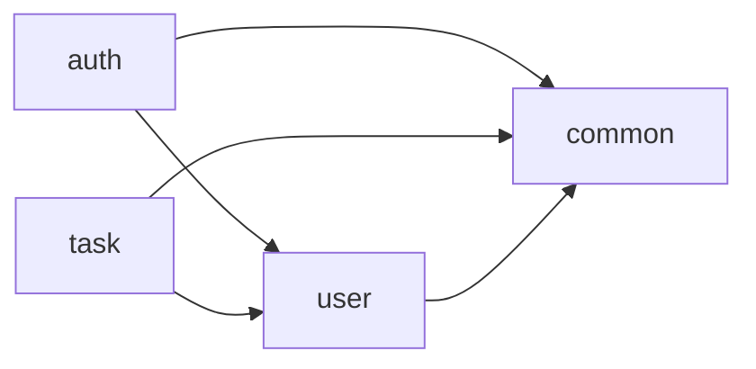

# Task Manager

A Spring Boot and Angular learning project focused on modular architecture,
role-based access control, and organizational task management.

See the [changelog](CHANGELOG.md) for the latest project changes.
Use the [documentation index](docs/README.md) to find setup, API, deployment,
and architecture guides.

## Project Status

**Backend APIs and operational safeguards implemented:** the Spring Boot application and Maven Wrapper
are present. The `user` and `auth` modules provide account REST endpoints, persistence,
and JWT authentication. See [backend setup and module API](backend/README.md).
The task domain, application use cases, persistence, and runtime wiring are implemented.
Personal and administrative task HTTP endpoints and runtime OpenAPI/Swagger UI are
implemented. Production startup safeguards, authentication rate limiting, and
operational diagnostics are also implemented. See the [deployment guide](docs/deployment.md).
Local PostgreSQL Docker Compose and an Angular frontend scaffold are available.
The frontend has lazy routes, a responsive layout, and a development API proxy;
authentication and task/account integration remain pending.
The scope below describes the full planned v1.

The implemented backend is ready for frontend integration. The full Maven suite
and local packaged production smoke test pass; validation of the actual deployment
environment remains separate. See [remaining backend work](backend/README.md#remaining-backend-work).

## Planned Scope

- Registration, login, and password changes.
- Create automatically self-assigned tasks; list, read, update, and delete tasks assigned to you.
- Administrators can create tasks assigned to users or other administrators,
  and list, read, update, or delete all tasks through administrative routes.
- An Angular interface for login, task lists, forms, and filters.
- Administrator operations for listing accounts, assigning roles, and
  enabling or disabling accounts.

All tasks, including user-created tasks, are accessible to their assignee and all
administrators. Personal `/tasks` routes remain assignee-scoped; `/admin/tasks`
provides global administrative access. Reassignment after creation,
general task sharing, and a separate viewer role are outside the accepted
v1 scope. Draft task fields and status transitions are defined in the
[API contract](docs/api/README.md).

### Roles and Permissions

| Operation | USER | ADMIN |
| --- | --- | --- |
| Create self-assigned tasks and manage assigned tasks | Allowed | Allowed |
| Create tasks assigned to users or admins | Denied | Allowed |
| List, read, update, delete all tasks | Denied | Allowed through admin routes |
| Change own password | Allowed | Allowed |
| List accounts, assign roles, enable/disable accounts | Denied | Allowed |

Registration always assigns `USER`. Account permissions are enforced by backend
services and HTTP security. Task application services enforce assignment and access
rules through persistence and principal adapters, with H2 integration coverage.
Frontend guards remain planned. See
[ADR-0006](docs/adr/0006-security.md) for the authorization policy.

## Planned Technology Baseline

| Component | Baseline |
| --- | --- |
| Java | 21 LTS |
| Spring Boot | 3.5.x |
| Spring Modulith | 1.4.x |
| Backend build | Maven through the committed Maven Wrapper |
| Frontend | Angular 21 with matching Angular CLI |
| UI library | None; the scaffold uses SCSS |
| Node.js | 22.x, at least 22.12.0 |
| Frontend package manager | npm with a committed lockfile |
| Disposable development database | H2 in memory |
| Persistent database | PostgreSQL 16 |
| Schema migrations | Flyway |
| Authentication | HS256 JWT bearer tokens |
| Runtime API documentation | OpenAPI 3.1 and Swagger UI through springdoc |

Backend versions are pinned in its POM and Maven Wrapper. Frontend dependency
resolutions are recorded in its npm lockfile. Version selection and maintenance requirements are defined in
[ADR-0005](docs/adr/0005-build-tool.md).

## Architecture

The monorepo contains a single Spring Boot backend deployable. A separate Angular
SPA is scaffolded; its authenticated REST integration is the next milestone.

| Location | Purpose | Current state |
| --- | --- | --- |
| `backend/` | Spring Boot modular monolith | Account/task HTTP APIs, JWT security, persistence, and transactional task auditing implemented |
| `frontend/` | Angular SPA | Responsive shell, lazy preview pages, and development API proxy |
| `docs/adr/` | Accepted architecture decisions | Available |
| `docker-compose.yml` | Local PostgreSQL infrastructure | Persistent volume, loopback port, and health check implemented |

### Backend Modules

| Module | Responsibility | Allowed module dependencies |
| --- | --- | --- |
| `auth` | Login, tokens, HTTP security configuration | `user`, `common` |
| `user` | Accounts, credentials, roles, account administration | `common` |
| `task` | Task lifecycle, assignment, and access enforcement | `user`, `common` |
| `common` | Shared utilities, Problem Details, OpenAPI metadata, production checks, and request diagnostics | None |

Arrows show allowed dependencies on another module's public API, as declared in
each module's `package-info.java` and checked by Spring Modulith tests.



The `auth`, `user`, and `common` modules are implemented and closed; `task` is a
closed module with domain, application logic, persistence, HTTP, and principal/audit adapters
implemented. Public module contracts and DTOs live in module root packages. Internal
code separates application use cases, infrastructure, presentation, and domain
rules where applicable. HTTP request DTOs remain internal to presentation packages.
The task domain stores immutable assignee and creator IDs. Application
services validate recipients through the public `user` API. Persistence uses
stable account IDs without cross-module JPA associations.

### Task implementation sequence

1. **Completed: domain.** Task fields, Unicode character limits, immutable attribution,
   optional due dates, and all TODO/IN_PROGRESS/DONE transitions are implemented.
2. **Completed: application business logic.** Task use cases enforce assignment validation
   and personal/admin access rules through storage, current-user, and audit ports.
   Tests exercise these rules with in-memory fakes.
3. **Implemented: persistence and adapters.** JPA storage, the V2 migration, principal lookup,
   transactional service wiring, and audit storage are in place. H2 and PostgreSQL
   migration/integration tests pass, including audit rollback and deletion history.
4. **Implemented: HTTP API.** Personal/admin controllers, request/response DTOs,
   partial-update handling, and Problem Details mapping are in place.
5. **Implemented: runtime API documentation.** Swagger UI and generated JSON/YAML
   describe all 16 operations. Contract comparison and documentation access tests
   run during Maven verification.

Runtime API documentation is implemented and compared with the checked-in contract.
Local PostgreSQL Compose and packaged production smoke testing are available.
Frontend authentication and task/account integration remain pending.

See the [task implementation guide](backend/README.md#task-domain-and-next-steps) for the
implemented rules and remaining responsibilities.

Spring Modulith verification tests check module cycles, internal-package
access, and explicit dependency allowlists during Maven verification. Skipping
tests skips those checks. `LayerArchitectureTests` also enforce domain, application,
and presentation dependency boundaries across modules. See
[ADR-0007](docs/adr/0007-modulith.md).

Synchronous APIs support interactions requiring an immediate answer, such as
credential verification. Events are optional for independent reactions, with
delivery and consistency requirements defined before introducing them.

The Angular frontend uses standalone components and lazy pages under `src/app/pages/`.
Its client-side layout includes overview, task, and user previews. Shared authentication,
guards, and bearer-token interceptors remain planned; SSR is not enabled.

## Database Profiles

See the [database schema guide](docs/database.md) for the ER diagram, constraints,
indexes, and transactional audit behavior.

- **Quick development:** disposable H2 with Hibernate schema creation/drop and
  Flyway disabled.
- **PostgreSQL development:** an externally supplied PostgreSQL 16 instance, Flyway
  migrations, and Hibernate schema validation. See [local PostgreSQL Compose](docs/local-postgres.md).
- **Production:** explicitly select `prod`, which includes PostgreSQL with migrations
  and validation, rejects unsafe settings, and requires secure transport. See the
  [deployment guide](docs/deployment.md); local Compose is not a production deployment plan.
- **Integration tests:** PostgreSQL Testcontainers running the same migrations.

H2 runs do not validate PostgreSQL behavior. Persistence changes must pass
PostgreSQL integration tests. See [ADR-0002](docs/adr/0002-database.md).

## API and Authentication

The draft [OpenAPI 3.1 contract](docs/api/openapi.json) defines endpoints, request
and response schemas, validation, and errors. See the [contract guide](docs/api/README.md)
for task lifecycle rules, implemented HTTP behavior, and verification limits.
Task request examples are available in the [HTTP walkthrough](backend/README.md#try-the-task-api).

The implemented account and task APIs use REST and JSON under `/api/v1`, with RFC 9457 Problem
Details errors (`application/problem+json`). Runtime OpenAPI 3.1 is available at
`/v3/api-docs` (JSON) and `/v3/api-docs.yaml`; Swagger UI is at `/swagger-ui.html`.
Documentation is public in local H2 development and disabled by default elsewhere.
`API_DOCS_ENABLED=false` disables it locally; setting it to `true` explicitly makes
it public in another non-production profile. The `prod` profile refuses enabled
documentation. See the
[runtime documentation guide](backend/README.md#runtime-openapi-and-swagger-ui).

HTTP security is configured by
[`HttpSecurityConfiguration`](backend/src/main/java/net/mbope/taskmanager/auth/internal/infrastructure/HttpSecurityConfiguration.java)
for servlet web applications. Registration and login are public; `/api/v1/admin/**`
requires ADMIN, and API routes otherwise require authentication. Documentation routes
are public only when enabled and denied to every role when disabled. Minimal health
GET endpoints are public; other management routes are denied even to ADMIN. JWT `roles` map to
Spring Security authorities with the `ROLE_` prefix. The filter chain is stateless,
with request caching, CSRF, form login, HTTP Basic, and server-side logout disabled.
See the [backend security guide](backend/README.md#security-and-http-code-ownership)
for CORS handling and internal error dispatches.

Requests authenticate through `Authorization: Bearer <token>`. The v1
authentication tradeoffs are explicit:

- Access tokens expire after 15 minutes. The planned frontend must keep them only in memory.
- Reloading the page or reaching token expiry requires login again; there are
  no refresh tokens.
- Logout clears the local token but does not revoke a copied token.
- Password, role, and account-status changes do not invalidate existing tokens.
  Their previous authority remains until expiry, at most 15 minutes after issuance.
- Disabled accounts cannot obtain new tokens.
- Replacing the active signing key across instances invalidates all existing tokens.

Signing keys and database credentials come from environment variables. Deployed
environments require HTTPS. Login and registration have bounded per-client and
per-process request limits. Multiple instances require shared gateway limits; see
[production limits and diagnostics](docs/deployment.md).

The first administrator is provisioned through the controlled operator procedure in
[the backend guide](backend/README.md#administrator-provisioning-and-recovery):
register through HTTP, promote the account using authorized SQL access, then log in.
No default credentials are shipped.

See [authentication](docs/adr/0003-authentication.md),
[API design](docs/adr/0004-api-design.md), and
[security](docs/adr/0006-security.md) for the complete decisions.

## Getting Started

Install JDK 21 or newer and make it available through `JAVA_HOME` or `PATH`.
Use the committed Maven Wrapper; a separate Maven installation is not required.
The first run needs network access to download Maven and project dependencies.

### Start the backend locally

From the repository root in Windows PowerShell:

```powershell
cd backend
.\setup-local.ps1
.\mvnw.cmd spring-boot:run
```

Run the setup script once per checkout. It creates a signing key in
`backend/.local/application.properties`, which Git ignores, and preserves an
existing file. On subsequent starts, run only `.\mvnw.cmd spring-boot:run` from
`backend/`. An environment `JWT_SECRET` overrides the local key.

The default `h2` profile starts the API at `http://localhost:8080` without Docker
or a separate database. H2 data is lost when the application stops. Press `Ctrl+C`
to stop it. Open `http://localhost:8080/swagger-ui.html` to explore the API.
The frontend runs separately on port 4200; an unauthenticated request to the backend's `/` returns 401.

On Unix, run `pwsh ./setup-local.ps1` if PowerShell is installed, then
`./mvnw spring-boot:run`, both from `backend/`. Alternatively, supply an external
`JWT_SECRET` as described in the
[authentication configuration guide](backend/README.md#authentication-configuration).
PostgreSQL startup requires an external signing key and database configuration;
see the [backend guide](backend/README.md#run-and-verify).

### Start the frontend

Keep the backend running, then open a second terminal at the repository root:

```powershell
cd frontend
npm ci
npm start
```

Open `http://localhost:4200`. The development server forwards `/api/**` to the backend
on `http://127.0.0.1:8080`. Overview, My tasks, and Users are preview pages; they do
not yet load protected data or provide sign-in and CRUD operations.

From `frontend/`, run `npm run build` and `npm test -- --watch=false` to verify the
scaffold. See the [frontend guide](frontend/README.md) for prerequisites and proxy
troubleshooting. Production hosting needs its own API forwarding and SPA fallback.

### Test registration and login with Postman

With the backend running, follow the
[Postman walkthrough](backend/README.md#test-registration-and-login-with-postman)
to register an account, log in, and send a bearer token. It includes JSON request
bodies, expected status codes, and checks for invalid credentials and permissions.
The default H2 database loses accounts when the backend stops.

### Test the backend

Run these commands from `backend/`. Tests start their own application contexts
and supply a test signing key, so a running backend and local key setup are not required.

For the full test suite and a clean package build, start a Docker-compatible
container runtime first, then run:

```powershell
.\mvnw.cmd clean verify
```

This includes unit, HTTP/JWT, architecture, Spring Modulith, and PostgreSQL
Testcontainers checks. Testcontainers starts its own PostgreSQL database;
Docker-dependent tests fail if Docker is unavailable.

To run the tests that do not require Docker and build the package:

```powershell
.\mvnw.cmd "-Dtest=*,!UserModuleTests,!TaskManagerApplicationTests,!PostgresTaskPersistenceTests,!ProductionHttpTests,!ProductionTrustedProxyTests" clean verify
```

This excludes the five PostgreSQL-dependent test classes and does not verify
PostgreSQL migrations or persistence. Run the full suite with Docker before
treating those behaviors as verified.

On Unix, use `./mvnw` instead of `.\mvnw.cmd`, keeping the test selector quoted.
Test reports are written to `backend/target/surefire-reports/`.

See the [backend guide](backend/README.md) for account endpoints, module contracts,
and administrator provisioning. For the frontend, run `npm ci` and `npm start` from
`frontend/`, then open `http://localhost:4200`. See the [frontend guide](frontend/README.md)
for routing, proxy settings, tests, and production hosting requirements.

## Architecture Decision Records

- [ADR-0001: Architecture and repository layout](docs/adr/0001-architecture.md)
- [ADR-0002: Database profiles and migrations](docs/adr/0002-database.md)
- [ADR-0003: Authentication and token lifecycle](docs/adr/0003-authentication.md)
- [ADR-0004: REST API and error contract](docs/adr/0004-api-design.md)
- [ADR-0005: Build tools and versions](docs/adr/0005-build-tool.md)
- [ADR-0006: Security and authorization](docs/adr/0006-security.md)
- [ADR-0007: Module boundaries and verification](docs/adr/0007-modulith.md)

## V1 Delivery Checklist

- [x] Backend scaffolded with pinned tools and dependencies.
- [x] Frontend scaffolded with routing, a development API proxy, and an npm lockfile.
- [x] Task fields, validation, and lifecycle specified in the draft API contract.
- [x] Task domain implemented and verified with domain and architecture tests.
- [x] Task application use cases and authorization verified independently of persistence.
- [x] Task persistence, principal wiring, audit survival, and rollback verified against H2.
- [x] Account registration, login, token rejection, and password changes verified through HTTP tests.
- [ ] Frontend authentication, expiry handling, and client-side logout work end to end.
- [x] Task application tests cover user isolation, admin access, and assignment validation.
- [x] Task isolation, self-assignment, and admin assignment verified through HTTP and H2 persistence.
- [x] Administrative task edits/deletions and audit rollback verified against H2.
- [x] Account administration and documented administrator bootstrap work through HTTP (H2 verified).
- [x] Disabled-account login and the accepted stale-token behavior verified.
- [x] Module verification is included in Maven tests and passes in the focused run.
- [x] Verify the current revision against PostgreSQL, including V2 migration and task transaction behavior.
- [x] Backend validation, 401, 403, and ownership-related 404 errors verified through HTTP tests.
- [ ] Frontend login, task list, forms, and filters work with the backend.
- [x] Local Compose starts PostgreSQL; application startup is documented separately.
- [x] Development API documentation is available; production access is disabled by default.
- [x] Production configuration checks, authentication quotas, and health/request diagnostics are implemented.
- [x] Packaged production JAR verified with PostgreSQL and certificate-verified TLS.
- [ ] Frontend/backend flows verified together through the browser.
- [ ] Actual deployment transport, backups, limits, and monitoring verified before public release.
- [ ] Setup and verification instructions are reproducible from a fresh checkout.

Latest verification (2026-09-28): `.\mvnw.cmd clean verify` passed all 248 tests
and built the executable JAR. This includes 218 Docker-free tests and 30 PostgreSQL-backed
tests, including V2 migration/constraint checks and transactional task audit rollback.
The earlier Docker and Maven-cache failures were restricted-process access errors;
the normal Maven build succeeds with access to Docker and the dependency cache.

The [packaged production smoke test](docs/deployment.md#packaged-production-smoke-test)
also passed against isolated PostgreSQL over certificate-verified TLS.

Frontend verification (2026-09-29): the production build and all six tests passed.
A live development-proxy check returned the backend's expected 401 Problem Details
for `/api/v1/tasks`; direct loading of `/tasks` served the app shell. Visual browser
verification and authenticated frontend/backend flows remain unverified.

CI configuration is outside v1 scope. Local verification is required; future CI
must run the same checks.

## License

No license has been specified. This repository is a learning project.
