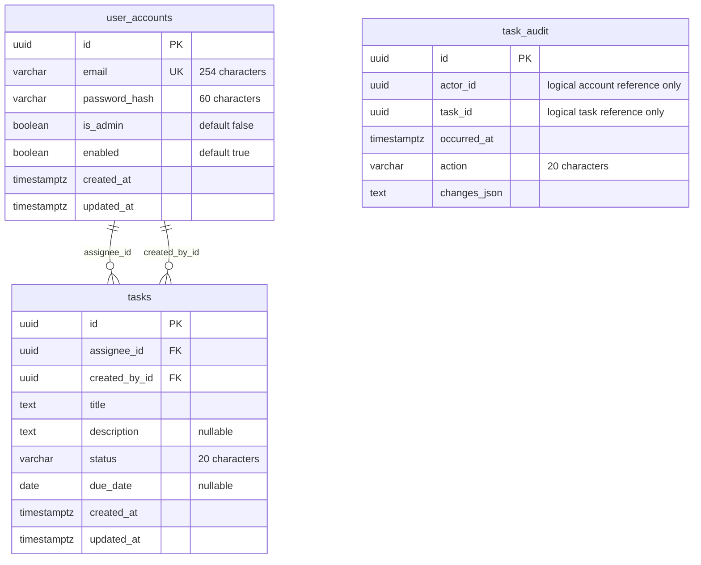

# Database schema and persistence

PostgreSQL 16 is the persistent database. The schema source of truth is the ordered
[Flyway migration directory](../backend/src/main/resources/db/migration), rather
than Hibernate-generated DDL. This guide describes V1 and V2 and the persistence
adapters that use them.

For database startup and connection settings, use the [local PostgreSQL guide](local-postgres.md).
For production credentials, migration rollout, and backup/restore checks, use the
[deployment guide](deployment.md). The profile decision is recorded in
[ADR-0002](adr/0002-database.md).

## Entity relationships

The diagram shows all application columns and only database-enforced relationships.
`PK`, `FK`, and `UK` mark primary, foreign, and unique keys. `timestamptz` below is
shorthand for the migrations' `TIMESTAMP WITH TIME ZONE` type; nullable columns are
marked explicitly. Flyway's own `flyway_schema_history` metadata table is omitted.



Each task has exactly one assignee and one creator; either account can be referenced
by many tasks, and the same account may fill both roles. JPA stores scalar account
UUIDs without cross-module entity associations. The `task` module validates assignment
recipients through the public `user` API.

`task_audit` is intentionally disconnected in the physical diagram: neither `task_id`
nor `actor_id` has a foreign key. They retain attribution without requiring a live
referenced row. This does not imply that account deletion is exposed by the API.

## Tables and constraints

All columns are required except `tasks.description` and `tasks.due_date`. Hibernate
generates UUID primary keys; the migrations do not define database UUID defaults.
Application code supplies timestamps, represented by Java `Instant`; due dates use
`LocalDate` and SQL `DATE` without a time of day.

| Table | Owning module | Stored data and database constraints |
| --- | --- | --- |
| `user_accounts` | `user` | Email, password hash, administrator/enabled flags, and timestamps. `uk_user_accounts_email` enforces unique email; `ck_user_accounts_normalized_email` requires `email = lower(btrim(email))`. |
| `tasks` | `task` | Assignee/creator UUIDs, editable task fields, and timestamps. Both account IDs reference `user_accounts(id)`. Title length is 1–200 characters; nullable description is at most 10,000 characters. Status is restricted to `TODO`, `IN_PROGRESS`, or `DONE`. |
| `task_audit` | `task` | Actor/task UUIDs, occurrence time, action, and serialized changes. `ck_task_audit_action` permits only `UPDATE` or `DELETE`. `changes_json` is `TEXT`, with no database JSON validation. |

Roles use a boolean representation: all accounts have `USER`, and `is_admin=true`
adds `ADMIN`. There is no role join table. Passwords are stored as hashes, never
as plaintext credentials.

The database constraints complement application validation. They do not implement
authorization, enabled-recipient checks, nonblank-title rules, email syntax checks,
or immutable attribution. The domain/services and JPA mappings enforce those rules.
For example, SQL length checks alone would allow a whitespace-only title.

## Indexes and query behavior

| Index | Columns | Intended query support |
| --- | --- | --- |
| `ix_user_accounts_created_at_id` | `created_at DESC, id ASC` | Stable account list ordering |
| `ix_tasks_assignee_created_id` | `assignee_id, created_at DESC, id ASC` | Personal task lists and admin lists filtered by assignee |
| `ix_tasks_created_id` | `created_at DESC, id ASC` | Global administrative task lists |
| `ix_task_audit_task_time` | `task_id, occurred_at, id` | Task-specific audit history ordering |

Primary keys and the unique email constraint also have backing indexes. These
indexes describe schema intent, not a guarantee that every query uses an index.

Task lists apply assignee scope, optional status, and optional title filtering before
both counting and pagination. Ordering is `created_at DESC, id ASC`. Title search
uses a case-insensitive literal substring: the adapter escapes `%`, `_`, and its
escape character before constructing the `LIKE` pattern. V2 adds no dedicated
status or title-search index; evaluate query plans before adding indexes for scale.
See [JpaTaskStore](../backend/src/main/java/net/mbope/taskmanager/task/internal/infrastructure/persistence/JpaTaskStore.java).

## Deletion and transactional auditing

Task deletion permanently removes the task row. The account foreign keys do not
declare cascading deletion: referenced accounts cannot simply be deleted while
tasks still reference them. Disabling an account is a separate account operation.

Administrative task updates and deletions append audit records in the same transaction
as the task mutation. Personal-route mutations and task creation do not append these
administrative audit records, even when the caller is an administrator using personal
routes. Audit rows already present survive subsequent task deletion because there
is no task foreign key or cascade.

`changes_json` serializes field names to `before`/`after` values. Updates include
changed fields; deletion records the previous task fields with null `after` values.
Audit persistence flushes both task and audit writes before returning. If serialization
or persistence fails, the shared transaction rolls back the task change too.
See [JpaTaskAudit](../backend/src/main/java/net/mbope/taskmanager/task/internal/infrastructure/persistence/JpaTaskAudit.java).

Audit retrieval is not part of the public v1 API. Access to audit data is an operator
responsibility; records can contain previous task titles and descriptions.

## Migrations and database profiles

| Migration | Schema change |
| --- | --- |
| [V1](../backend/src/main/resources/db/migration/V1__create_user_accounts.sql) | Creates accounts, email constraints, and account list index |
| [V2](../backend/src/main/resources/db/migration/V2__create_tasks_and_audit.sql) | Creates tasks, account foreign keys, task constraints, audit storage, and task/audit indexes |

Applied migrations are immutable. Add the next versioned SQL migration for a schema
change, update the entity mappings and this guide, and verify both fresh creation
and upgrades from the previously deployed schema. Do not use Hibernate `update` or
`create-drop` for persistent environments.

| Profile | Schema management | Verification limit |
| --- | --- | --- |
| `h2` | Disposable in-memory schema generated by Hibernate; Flyway disabled | Does not execute PostgreSQL migrations or prove their constraints/dialect |
| `postgres` | Flyway migrations followed by Hibernate validation | Persistent development configuration; does not enable production safeguards |
| `prod` | Includes `postgres`; validates production settings before database initialization | Requires secure transport and deployment-specific operational checks |

H2 and PostgreSQL share entity mappings, but H2 schema generation does not reproduce
all constraints and indexes declared only in migration SQL.

## Verification

With Docker running, execute from `backend/`:

```powershell
.\mvnw.cmd clean verify
```

The full suite includes PostgreSQL Testcontainers. Task persistence tests cover
migration constraints, Unicode round trips, scoped filtering, stable pagination,
audit survival, and rollback after audit flush. H2 contract tests provide faster
feedback but do not replace PostgreSQL checks. For only the task PostgreSQL suite:

```powershell
.\mvnw.cmd "-Dtest=PostgresTaskPersistenceTests" test
```

The [packaged production smoke test](deployment.md#packaged-production-smoke-test)
also exercises migrations and task persistence through the actual JAR using isolated
PostgreSQL and verified TLS. Backup restoration and migration recovery remain
[deployment release checks](deployment.md#public-release-checklist).
