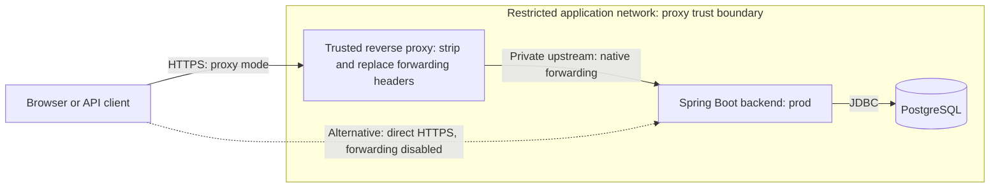

# Production deployment

The backend provides a guarded production profile, authentication request limits,
and operational diagnostics. Operators supply TLS infrastructure, secret delivery,
backups, and alerting.

## Startup configuration

Set `SPRING_PROFILES_ACTIVE=prod`. This profile group includes `postgres` and
requires `DB_URL`, `DB_USERNAME`, `DB_PASSWORD`, and `JWT_SECRET`.
Use persistent PostgreSQL, a dedicated database account, and a unique Base64-encoded
random signing key of at least 32 bytes. Supply secrets through the deployment
platform; never copy the local development key or test fixture.
Bare application startup still defaults to disposable H2 for local development:
always select `prod` explicitly in the deployment definition.

The `postgres` profile alone configures persistence without activating the production
guard or mandatory HTTPS. Do not use it as a substitute for `prod` on deployed hosts.

The production guard runs before datasource, Flyway, or Hibernate beans initialize.
It rejects H2, non-PostgreSQL URLs, empty database credentials, schema creation/update,
disabled Flyway, enabled Swagger/H2 console/SQL printing, disabled HTTPS enforcement
or rate limiting, unsafe management exposure, and detailed default error responses.
Hibernate validates the schema; Flyway applies migrations. Schedule migrations and
back up the database before releases; test restoration and release recovery separately.

Documentation is disabled in `prod`; `API_DOCS_ENABLED` cannot enable it there.
Overriding the underlying documentation properties to true causes startup to fail.
Production CORS origins must be explicit HTTPS origins; leaving `CORS_ALLOWED_ORIGINS`
empty denies cross-origin browser requests.

## HTTPS and trusted proxies

The diagram shows two alternative transport modes for the same backend. In proxy
mode, only the configured proxy peers may supply trusted forwarding information;
the backend port must be protected from direct public access.



The direct-TLS alternative terminates HTTPS in the application and does not trust
forwarding headers. Database transport security is configured separately in the
deployment's PostgreSQL connection settings.

Choose one transport configuration in your external application properties file.
For TLS at the application, configure a certificate/key store with Spring Boot's
`server.ssl.*` properties, set `server.ssl.enabled=true`, and retain
`server.forward-headers-strategy=none`.

For TLS terminated at a reverse proxy, use a narrow proxy IP pattern, for example:

```properties
server.forward-headers-strategy=native
server.tomcat.remoteip.internal-proxies=10[.]0[.]0[.]10
```

Replace the example with actual proxy addresses. Do not trust all addresses.
Keep the application port private and reachable only by the proxy/health checker.
The proxy must strip caller-supplied forwarding headers and set the real client IP
and HTTPS scheme. Native Tomcat processing trusts configured proxy peers; the
application limiter never parses `X-Forwarded-For` itself. Framework forwarding
and blank or unrestricted `.*`/`.+` proxy patterns are rejected by the guard.
Operators remain responsible for reviewing other patterns for overly broad trust.

Reject HTTP credentials at the public edge. The application also requires secure
requests and rejects insecure traffic with 403 `https-required` Problem Details.
This cannot protect credentials already sent over HTTP. Configure health checks through HTTPS or the trusted proxy.

Build and start the packaged application with externally supplied settings:

```powershell
cd backend
.\mvnw.cmd clean verify
$env:SPRING_PROFILES_ACTIVE = "prod"
# Supply database and JWT secrets through your deployment platform.
java -jar target/TaskManager-0.0.1-SNAPSHOT.jar --spring.config.additional-location=file:/etc/taskmanager/application.properties
```

Use an external configuration path appropriate to the deployment host. Containers
are optional; the repository provides local PostgreSQL Compose, but no application
Dockerfile or production orchestration.

## Frontend hosting

The Angular scaffold uses client-side rendering without SSR. Build it with
`npm ci` and `npm run build` from `frontend/`, then serve the contents of
`frontend/dist/Taskmanager/browser/` through the deployment's static web server.

Forward `/api/**` to Spring Boot before applying a fallback to `index.html` for
frontend routes such as `/home`, `/tasks`, and `/users`. API errors must remain API
responses rather than becoming the SPA HTML page. Static asset requests should
resolve to actual files. Angular's `proxy.conf.json` is used only by `npm start`;
it does not configure production routing or backend proxy trust.

Same-origin hosting lets API services use relative `/api/v1/...` URLs. If deploying
the frontend and API on separate origins, configure the client API URL and the
backend's explicit HTTPS CORS allowlist for that arrangement.

The current pages are public previews that load no protected data. Registration,
login, guards, and task/account operations remain pending; do not treat the scaffold
as a completed authenticated application. See the [frontend guide](../frontend/README.md).

## Authentication request limits

POST login and registration requests are limited before JSON parsing and password
hashing. Every admitted attempt counts, including successful and malformed requests.
OPTIONS preflight is excluded; other API operations do not consume these quotas.

| Property | Default |
| --- | --- |
| `app.rate-limit.enabled` | `true`; cannot be disabled in prod |
| `app.rate-limit.window-seconds` | 60 |
| `app.rate-limit.login-per-client` | 20 |
| `app.rate-limit.register-per-client` | 5 |
| `app.rate-limit.login-global` | 200 |
| `app.rate-limit.register-global` | 50 |
| `app.rate-limit.max-clients` | 10000 |

Configure these properties in the external configuration file. Limits must be
positive; the window is capped at 3600 seconds and client tracking at 100000 entries.
Quotas are separate per operation and keyed by the container-resolved client IP.
Process-wide limits constrain clients rotating addresses. At tracking capacity,
new addresses are rejected until the next window rather than evicting active quotas.

Rejection returns HTTP 429 with `application/problem+json`, type
`urn:task-manager:problem:rate-limited`, `Retry-After` in whole seconds, and
`Cache-Control: no-store`. CORS exposes `Retry-After` and `X-Request-ID` to allowed origins.

This is bounded, in-memory, fixed-window protection for one application process.
Counters reset on restart, boundary bursts are possible, and clients behind a shared
NAT share a quota. Tune limits after benchmarking BCrypt on deployment hardware.
Multiple instances require a shared gateway/distributed limiter; add account-aware
abuse controls there for credential stuffing. These quotas do not replace edge
connection limits, JSON body-size limits, timeouts, or bot protection.

## Health, logs, and metrics

Only GET of these management URLs is public, over the configured secure transport:

| URL | Meaning |
| --- | --- |
| `/actuator/health` | Overall health, status only |
| `/actuator/health/liveness` | Process liveness; independent of PostgreSQL |
| `/actuator/health/readiness` | Readiness state and database connectivity |

Health details and component names are hidden. Other management routes are denied,
even to ADMIN, and management JMX exposure is disabled. PostgreSQL outages affect
readiness rather than liveness, avoiding database-driven restart loops.
Shutdown is graceful with a 30-second shutdown-phase timeout; give the process
sufficient termination time in the deployment platform.

Application-filter responses carry a server-generated UUID in `X-Request-ID`.
Caller-provided IDs are ignored. The ID is included in logging MDC and removed or
restored after the request. Unexpected MVC failures log the ID, exception class,
and stack locations; this handler omits messages, causes, request bodies, query
strings, and credentials. Clients still receive a generic 500 Problem Detail.
Restrict log access and retention, and avoid request-body/SQL parameter logging.
Errors rejected before the application filter chain may not carry a request ID.

Actuator instruments HTTP requests and JVM/process metrics. The limiter records
`auth.rate.limit.rejections` with fixed `operation=login|register` tags; IPs and
account identifiers are not labels. Metrics remain internal by default. Connect
an approved registry exporter before relying on metric-based alerts; no public
metrics, environment, configuration, or heap-dump endpoint is enabled.
Monitor readiness, HTTP 5xx responses, rejection rates, and resource saturation.

## Verification and release checks

From `backend/`, focused checks without Docker:

```powershell
.\mvnw.cmd "-Dtest=ProductionConfigurationTests,AuthenticationRateLimiterTests,OperationalHttpTests,DiagnosticsTests,OpenApiTests" test
```

With Docker, run `.\mvnw.cmd clean verify`. `ProductionHttpTests` starts the prod
profile with PostgreSQL migrations and an embedded server; it checks secure health
and API access, and rejection of spoofed HTTPS headers from an untrusted network peer.
Configuration tests reject unsafe overrides before other beans initialize. Limiter
tests cover expiry, separate/global quotas, capacity, concurrency, CORS, and spoofing.
Diagnostics tests check correlation cleanup and exclusion of secret exception data.

`ProductionTrustedProxyTests` also uses real HTTP connections to verify successful
trusted forwarding, continued API authentication, and separate resolved-client quotas.

Latest verification (2026-09-28): `clean verify` passed all 248 tests, including
218 Docker-free and 30 PostgreSQL-backed tests, and packaged the executable JAR.

## Public release checklist

The following checks remain specific to the deployment environment. A passing
local test suite or packaged smoke run does not complete them:

- [ ] Verify public DNS, certificates, HTTPS enforcement, proxy trust, and private
  application-port access using the actual deployment configuration.
- [ ] Verify delivery of database credentials and the JWT signing key through the
  deployment platform, and confirm startup uses `prod`.
- [ ] Run registration, login, task operations, and authorization checks through
  the public HTTPS URL; verify browser CORS against the intended frontend origin.
- [ ] Restore a database backup and verify the recovered application data. Exercise
  the migration/recovery procedure before changing a deployed schema.
- [ ] Configure and exercise edge request-body limits, connection limits, and timeouts.
- [ ] Connect monitoring and alerts for readiness, HTTP failures, authentication
  rejection rates, and resource saturation; confirm alerts reach the operator.
- [ ] Review release dependencies and resolve applicable findings.
- [ ] If running multiple instances, configure shared authentication rate limiting
  and verify that distributing requests across instances cannot bypass the quota.

Existing 15-minute JWT revocation limitations and operator administrator recovery
procedures still apply. Automated CI is a future improvement outside the current
v1 scope; local verification remains required.

## Packaged production smoke test

After `clean verify`, run from `backend/` on Windows PowerShell:

```powershell
.\smoke-prod.ps1
```

Requires Docker Compose v2, `java`, JDK `keytool`, and `curl.exe` on `PATH`.
If necessary, add your JDK's `bin` directory to `PATH`. An optional `-JarPath`
selects another already-built executable JAR. The script does not build the artifact.

The script creates an isolated Compose project with a random published database
port and credentials, generates a short-lived localhost certificate, and runs
`java -jar` with `prod` and direct TLS. Curl verifies that certificate and hostname;
TLS verification is never disabled. Checks cover readiness, registration/login,
task create/read/list/update/delete, anonymous and non-admin rejection, disabled
documentation, and a 404 after deletion. Successful API calls exercise Flyway's
schema and PostgreSQL persistence through the packaged application.

The script stops its Java process, removes only its own Compose project and volume,
restores changed process environment variables, and deletes generated secrets and
request/response files. Logs and the public certificate remain under
`backend/target/taskmanager-smoke-*/` for diagnosis. A forcibly interrupted shell
may require cleanup of the specific project named in its output.

Verified on 2026-09-28: the packaged smoke test passed with certificate-verified TLS.
This validates a local production-profile deployment. Repeat the release checks
above against the actual deployment's DNS, certificate, proxy, and secret delivery.

## References

- [Spring Boot forwarding configuration](https://docs.spring.io/spring-boot/3.5/how-to/webserver.html)
- [Spring Boot management security and probes](https://docs.spring.io/spring-boot/3.5/reference/actuator/endpoints.html)
- [OWASP logging guidance](https://cheatsheetseries.owasp.org/cheatsheets/Logging_Cheat_Sheet.html)
